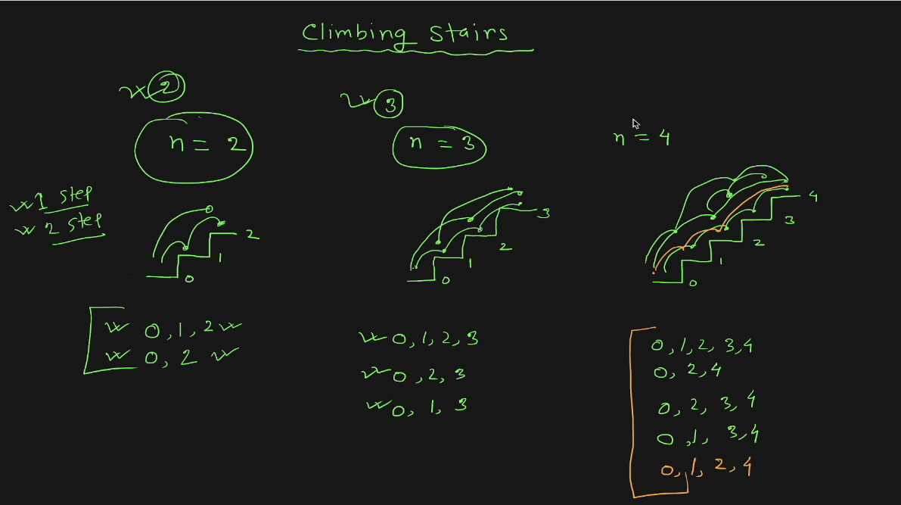
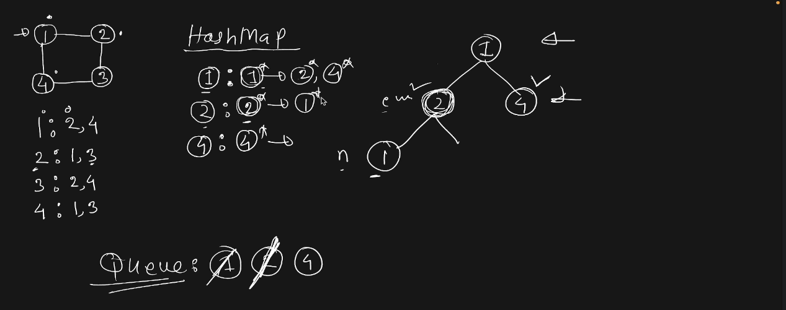
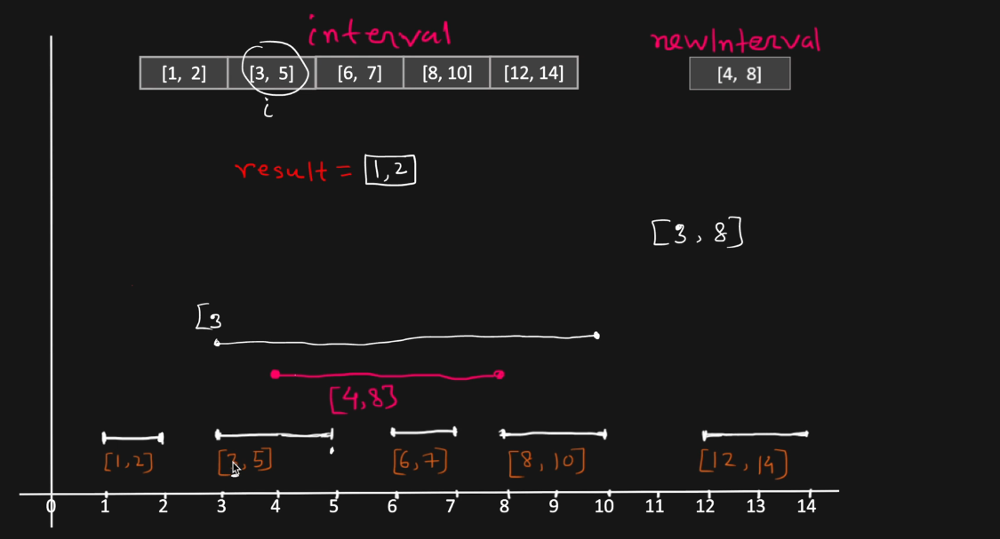

# algo

algorithm collections

### Sum of Two Integers
https://leetcode.com/problems/two-sum/description/?envType=study-plan-v2&envId=top-interview-150

We present the integer to bits and use bitwise operations to implement the sum of two integers.

### Climb stairs
https://leetcode.com/problems/climbing-stairs/description/?envType=study-plan-v2&envId=top-interview-150

### Clone graph
https://leetcode.com/problems/clone-graph/description/?envType=study-plan-v2&envId=top-interview-150

### Insert interval
https://leetcode.com/problems/insert-interval/description/?envType=study-plan-v2&envId=top-interview-150

